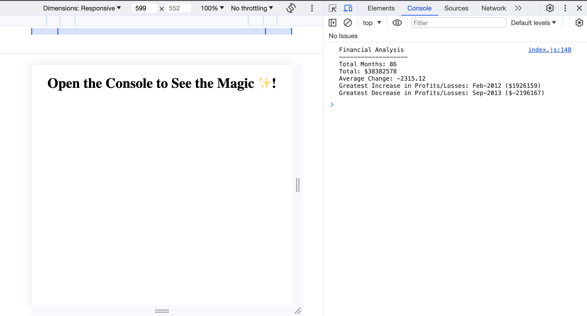

# Console Finances

This mini project includes code written in JavaScript to analyse the financial record of a company.

## The Challenge

Analysing the given records to calculate:

- The total number of months in the dataset.

- The net total amount of Profit/Losses.

- The average of the changes in Profit/Losses.

- The greatest increase and decrease in Profit/Losses.

## Screenshot

## Links

- Live Site URL: [Console Finances](https://fuadeyuboglu.github.io/Console-Finances/)

## License

Licensed under the MIT license.